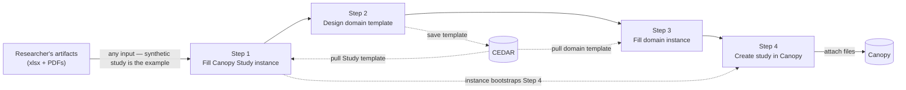

# Canopy: AI-Assisted Metadata Generation

### CollaborationFest 2026 project - [CoFest 2026](https://www.open-bio.org/events/bosc-2026/collaborationfest/)

A CollaborationFest 2026 project on **describing research data with AI**. Using an LLM together with our CEDAR tools, you turn ordinary research files — spreadsheets, protocols, papers — into standards-compliant metadata and a registered Canopy study, with a person reviewing along the way.

New to Canopy or CEDAR? Start with **Background** and **Goals** below — they explain the what and why. The **Project checklist** then lays out exactly what to do.

---

## Background

Research data is only as reusable as it is well described. For a dataset to be shared, found, and reused by others, it has to be documented with **structured metadata** — what the study was, who ran it, what was measured, in what units, using which standard terms. Producing that metadata by hand is slow, tedious, and error-prone — the "blank page" problem — and it is one of the biggest reasons otherwise valuable datasets never get described well enough to be discovered and reused. Lowering that barrier is central to making data FAIR: findable, accessible, interoperable, and reusable.

This work sits on top of two established open systems. **[Canopy](https://github.com/canopy-datahub)** is generalist **repository infrastructure**: a researcher registers a *study* and submits both its **data files** and the **metadata** describing them, and Canopy makes the result findable and downloadable according to an access policy (it is derived from the [NIH RADx Data Hub](https://radxdatahub.nih.gov/)). Every submission is organized around a study, and Canopy ships with a **generic study-metadata template** that every study fills in — the "Canopy Study template" referenced throughout this document.

**[CEDAR](https://cedar.metadatacenter.org/)** (the Center for Expanded Data Annotation and Retrieval) is the metadata standard those templates follow. A **template** is a reusable blueprint defining *what* metadata to capture — its fields, their types, and which values are allowed (for example, a "country" field must come from a controlled list, or a date must be a real date). An **instance** is a single record *filled in* against a template. A template is the empty form; an instance is the completed one.

Today, describing a dataset for one of these hubs is largely **manual**: a person designs or picks the template, then fills in valid instances field by field. That hand-work is the friction — and the reason so much data stays poorly described.

**The overall goal of this project is an AI-assisted workflow that does this for you** — reading a researcher's ordinary files (spreadsheets, data dictionaries, protocols, papers) and producing the standards-compliant metadata and the registered study that otherwise have to be built by hand, with a person reviewing along the way.

## Goals

The point of the CoFest is **developing and understanding** how to drive metadata description with AI — not shipping a finished product. So the tangible output is **prompts, strategies, and a lessons-learned document**, not (necessarily) software. The bundled synthetic study is only an example input; whatever you develop should generalize to *any* researcher's datasets and documents.

1. **Drive the [4-step workflow](#workflow) with an LLM of your choice** — fill the Canopy Study template, design a domain-specific template, fill it, and create the study in Canopy — using the CEDAR MCP servers.
2. **Capture the prompts and strategies that worked** — the prompts, the order of operations, what to feed the model, where it goes wrong, and how to recover. This is the primary deliverable.
3. **Write up lessons learned** — a short document distilling what works, what doesn't, and recommendations for doing this reliably and generically.
4. **Prove it on the example.** Run your approach against the bundled [synthetic study](#what-we-provide-example-input-data) and show the four steps complete end-to-end.

---

## Project checklist

What to do, start to finish. **Requirements** are things you need *before* you begin; **Initial configuration** is the one-time setup; then the **core tasks**.

### Requirements — check before you start

- [ ] An LLM you can use (Claude, ChatGPT, Gemini, …) — **you bring the license; we don't provide one**
- [ ] Able to create free accounts at [CEDAR](https://cedar.metadatacenter.org/) and [BioPortal](https://bioportal.bioontology.org/)
- [ ] A machine that can run **Java 17+** and **`uv`**

### ① Initial configuration — set up once ([details](#getting-started))

- [ ] Create your [CEDAR](https://cedar.metadatacenter.org/) and [BioPortal](https://bioportal.bioontology.org/) API keys
- [ ] Install **Java 17+** and **`uv`** — see [Prerequisites](#prerequisites-and-dependencies)
- [ ] [Install the CEDAR MCP servers](docs/INSTALL_MCPS.md) and connect them to your LLM client

### ② Tasks

- [ ] [Step 1](#step-1--fill-out-the-existing-canopy-study-template) — fill the Canopy Study template from the example artifacts
- [ ] [Step 2](#step-2--create-a-domain-specific-template) — design a domain-specific template
- [ ] [Step 3](#step-3--fill-the-domain-specific-template) — fill it (a valid instance)
- [ ] [Step 4](#step-4--create-the-study-in-canopy) — create the study in Canopy
- [ ] **Capture your prompts** and **write up lessons learned** — the [primary deliverable](#the-deliverable)

## MCP Servers

To work with CEDAR (and BioPortal) from an LLM, we use a set of handy **MCP servers** — you connect them to your LLM client and call them; there's no integration to build yourself. The four we use are listed below. Each is **self-documenting** (once connected, it advertises its own tools and parameters), and each repository's README covers setup and usage — start there.

> **What's an MCP?** The [Model Context Protocol](https://modelcontextprotocol.io/) is an open standard — a universal adapter that lets an AI assistant call external tools and data sources in a uniform way. An MCP *server* exposes a specific capability (here, a slice of CEDAR or BioPortal) as a set of callable tools. Because it's a shared standard, the same servers work across MCP-capable clients — Claude, ChatGPT, and others — so you can bring whatever LLM you have a license for.

| MCP server                                                                             | Runtime | What it does                                                                                                                    |
|----------------------------------------------------------------------------------------|--|---------------------------------------------------------------------------------------------------------------------------------|
| [`cedar‑artifact‑mcp`](https://github.com/metadatacenter/cedar-artifact-mcp)           | **Java** | Author and validate CEDAR templates and metadata instances **in memory** — build templates/fields/elements, fill instances, convert between YAML and CEDAR JSON. |
| [`bioportal‑term‑mcp`](https://github.com/metadatacenter/bioportal-term-mcp)           | **Python (`uv`)** | Look up ontology terms in BioPortal so values are anchored to real, standard identifiers (IRIs) instead of guessed free text. |
| [`cedar‑artifact‑rest‑mcp`](https://github.com/metadatacenter/cedar-artifact-rest-mcp) | **Java** | The I/O counterpart to `cedar-artifact-mcp`: **persist and fetch** artifacts on a live CEDAR server (create / get / update / delete / server-side validate). |
| [`cedar‑cee‑mcp`](https://github.com/metadatacenter/cedar-cee-mcp)                     | **Java** | **Show a template or instance as a form** in the browser — read-only to review, or editable so a person fills it in (via the CEDAR Embeddable Editor), with the result flowing back. |

All four are public — see [Links](#links). You don't install them by hand: a script downloads prebuilt servers and generates your client config ([docs/INSTALL_MCPS.md](docs/INSTALL_MCPS.md)). The one runtime note worth knowing: **only `bioportal-term-mcp` runs on Python (`uv`)** — the other three are **Java**.

> **API keys:** Working against live CEDAR and BioPortal requires free accounts and API keys. See [Getting Started](#getting-started). Never commit keys — `.gitignore` already excludes the usual files.

## Workflow

The workflow has two halves: first **describe** the study with CEDAR (Steps 1–3), then **submit** it to Canopy (Step 4). Steps 1–3 each produce a CEDAR artifact; Step 4 turns those into a live study. The whole thing runs over the [MCP servers](#mcp-servers), driven by an LLM.

**Input (Step 0):** the researcher's artifacts — datasets (XLSX/CSV, relational exports) and documents (papers, protocol, grant, SOP, supplementary PDFs). The bundled synthetic study is one example; the approach must work for any.

### Step 1 — Fill out the existing Canopy Study template
*What:* produce a filled **Canopy Study** instance from the artifacts. *Why:* every Canopy submission is built around a study, and Canopy provides a single generic study-metadata template (title, investigators, design, dates, …) that every study must populate. Filling it is the unavoidable first step, and an LLM can draft most of it by reading the protocol and dataset rather than the researcher typing it by hand. This instance also **bootstraps the study in Step 4**, so it's worth getting right first.
- The Canopy Study template is an existing CEDAR template (readable mirror in [`templates/`](templates/)); pull it live from its well-known CEDAR location with **`cedar-artifact-rest-mcp`**.
- Fill a valid instance from the PDFs/datasets with **`cedar-artifact-mcp`**, anchoring controlled values via **`bioportal-term-mcp`**.

### Step 2 — Create a domain-specific template
*What:* design a new CEDAR template that captures the metadata specific to *this* study's data — a flat, ~20-field template that constrains key fields to controlled terms (e.g. condition → MONDO, country → GAZ, sex → NCIT) and external identifiers (ORCID, PubMed ID, DOI), using proper types (numeric, date, boolean) rather than all strings, mirroring the [example dataset's columns](#what-we-provide-example-input-data). Designing this *is the task* — there's no template to copy. *Why:* the generic Study template describes the study, but not the particulars of the dataset — its condition, assays, organism, units, identifiers. A domain-specific template captures those, and crucially it constrains key fields to **controlled terms** so values are interoperable. A *controlled term* is a value drawn from an agreed vocabulary (an ontology) instead of free text — so "prediabetes" resolves to one canonical concept rather than a dozen spellings. **BioPortal** is the repository of biomedical ontologies those terms come from; the `bioportal-term-mcp` server looks them up. Controlled terms are what make a dataset findable and comparable across studies.
- Author the template with **`cedar-artifact-mcp`**; resolve controlled terms with **`bioportal-term-mcp`**.
- Upload it to CEDAR with **`cedar-artifact-rest-mcp`**; view/verify with **`cedar-cee-mcp`** or the CEDAR UI.

### Step 3 — Fill the domain-specific template
*What:* create a **valid instance** of the Step 2 template. *Why:* a template is just the empty form — the actual descriptive metadata only exists once it's filled in and conforms to the template (right field types, allowed values, required fields present). A *valid* instance is one CEDAR accepts as conforming; validity is what lets Canopy trust and publish the metadata downstream.
- Pull the Step 2 template back from CEDAR.
- Infer values from the artifacts and build the instance with **`cedar-artifact-mcp`**; upload it to CEDAR.

### Step 4 — Create the study in Canopy
*What:* register a new study in Canopy, **bootstrapping it from the Step 1 Study instance**, and attach the files. *Why:* this is where description becomes a real, shareable record — the point of the whole exercise. Instead of re-keying everything into the Canopy *Create Study* form, the Step 1 metadata pre-fills it.
- `study-metadata.json` (from Step 1) pre-fills the study fields — the *Create Study* page gets a button to upload it.
- The submission then follows Canopy's normal [Submission Workflow](#submission-workflow), and what others can see is governed by [Access Control](#access-control).



## Submission Workflow

Step 4 lands in Canopy's standard submission flow, so it helps to know how that works. Full walkthrough: [Canopy tutorial → Submission Workflow](https://canopy.stanford.edu/tutorial?tutorial=submissionWorkflow).

Getting data onto the platform involves two roles: a **Data Submitter**, who registers a study and uploads its files, and a **Data Curator**, who reviews the submission and approves or rejects it. A submission is only published after a curator reviews it — the author and the reviewer are deliberately different people. (An **Application Administrator** grants roles and manages the system.)

A study must exist before any files can be uploaded, so the flow is: **register the study** (and set its access level) → **create a submission and upload files** → **bundle** related files (a data file with its metadata and data dictionary) → **validate** (Canopy checks each bundle against the required metadata template and data-dictionary spec) → **review and submit**. The package is then read-only while the curator approves or rejects files (with a reason); on approval it's published per the study's access level, and both sides are notified by email. A completed submission isn't edited in place — to update data you start a new submission, and re-uploading a same-named file creates a new version, preserving history.

This matters for the project: the metadata our workflow produces is exactly what Canopy validates at the **validate** step, so well-formed CEDAR instances are what make a submission pass cleanly.

## Access Control

What others can see of a submitted study is governed by its access level. Full detail: [Canopy tutorial → Data Access Control](https://canopy.stanford.edu/tutorial?tutorial=dataAccessControl).

Access is set **per study** (it applies to the study's metadata and all its files), with three levels:

| Access level | Who can see the study and download its files |
|---|---|
| **Public** | Everyone, including visitors who aren't logged in. |
| **Limited** | Any logged-in user. |
| **Private** | Only the study's creator, plus Curators and Administrators. |

Newly registered studies default to **Public**, so set the level deliberately before sharing. It can be changed at any time by the study's creator, a curator, or an administrator, and is enforced everywhere a study is exposed — search/browse, the study overview, and every file download. (One nuance: variable-level *descriptions* can surface in variable search even for restricted studies, but the underlying data files stay protected.)

## The deliverable

The **primary deliverable is knowledge, captured as artifacts you can reuse** — not finished software. Concretely, by the end of the two days we want:

1. **A curated set of prompts** that drive [Steps 1–4](#workflow) with an LLM — the prompts themselves, the order to run them, what context to feed in, and the guardrails that keep the model on track.
2. **A lessons-learned document** — what worked, what didn't, where models go wrong (and how to recover), and recommendations for doing this reliably and *generically* across different inputs and different LLMs.
3. **The worked example** — the filled Canopy Study instance (Step 1) and the domain-specific template + instance (Steps 2–3), as CEDAR JSON-LD, produced from the bundled study, plus a registered study in Canopy.

**Prerequisite — bring your own LLM.** You need access to an LLM with tool/MCP support (Claude, ChatGPT, Gemini, …); we don't provide a license. Because the MCP servers are an open standard, the same prompts and servers should work across clients — comparing them is a welcome bonus.

Success looks like: **someone who isn't a CEDAR expert can follow your prompts and lessons-learned on their own data and end up with a registered, FAIR Canopy study.**

## What we provide (example input data)

The bundled **synthetic study (SPbE-2026)** is just an *example input* so you can build and test immediately — your approach must generalize beyond it. Under [`data/synthetic-study/`](data/synthetic-study/):

- **`SPbE-2026_dataset.xlsx`** — 40 subjects × 20 columns, plus a `data_dictionary` sheet. The same data is also provided as **`SPbE-2026_dataset.csv`** (open format, no licensing concerns).
- **`SPbE-2026_protocol.pdf`** — a ~10-page study protocol (rich free text to extract from).
- **`SPbE-2026_SOP_sample-collection.pdf`** — a supplementary SOP.

The dataset columns deliberately span varied CEDAR field types — numeric, date, boolean, ontology-controlled, and external-identifier — so the example exercises real metadata, not 20 strings:

| Column | Type | Controlled by / authority |
|---|---|---|
| `subject_id` | string | — |
| `enrollment_date`, `visit_date` | date | ISO-8601 |
| `age_years`, `bmi_kg_m2`, `baseline_glucose_mg_dl`, `week12_glucose_mg_dl`, `hba1c_pct`, `systolic_bp_mmhg`, `adherence_pct` | numeric | — |
| `sex` | controlled | NCIT |
| `country` | controlled | GAZ / ISO-3166 |
| `condition` | controlled | MONDO |
| `study_arm` | controlled | NCIT (study arm) |
| `on_glucose_medication`, `adverse_event`, `completed_study` | boolean | — |
| `investigator_orcid` | identifier | ORCID |
| `reference_pmid` | identifier | PubMed ID |
| `protocol_doi` | identifier | DOI |

These are AI-generated and entirely fictional — no real subjects or results. Regenerate with `python3 src/gen_data.py`.

## Repository structure

```
canopy-metadata-cofest-2026/
├── README.md                  ← this proposal
├── LICENSE                    ← GPL-3.0
├── .gitignore
├── data/
│   └── synthetic-study/       ← example study: dataset (xlsx + csv), dictionary, 10-pg protocol, SOP
├── templates/                 ← the provided Canopy Study template (the domain template is yours to design)
├── src/                       ← prompts/strategies, helper scripts, optional Skill; data generator lives here
├── docs/                      ← runbook + (to come) the prompts and lessons-learned writeup
└── images/                    ← diagrams / screenshots
```

## Getting Started

> Detailed, step-by-step instructions live in [`docs/RUNBOOK.md`](docs/RUNBOOK.md). Work through the setup below in order; it maps to **① Initial configuration** in the [Project checklist](#project-checklist).

### Prerequisites and dependencies

The CEDAR MCP servers run locally, so you need their toolchains installed before you can connect them:

- **Java 17+** — runs the three Java servers.
- **[`uv`](https://docs.astral.sh/uv/)** — runs the one Python server (`bioportal-term-mcp`) and the install script.
- **An LLM client with MCP/tool support** — Claude, ChatGPT, Gemini, etc. **Bring your own license; we don't provide one.**
- **Two free API keys** — BioPortal and CEDAR (the install guide walks you through getting them).

There's nothing to build or compile — an install script downloads the prebuilt servers. Full steps are in **[docs/INSTALL_MCPS.md](docs/INSTALL_MCPS.md)**.

> Each server's repo lists its exact requirements — treat those as the source of truth. If you'd rather not install by hand, your LLM/AI assistant can often install Java and `uv` and wire up the servers for you; just ask it to.

### Accounts & API keys

Create free accounts and generate API keys, then export them as environment variables (`CEDAR_API_KEY`, `BIOPORTAL_API_KEY`). **Never commit keys** — `.gitignore` already excludes the usual files.

- CEDAR: <https://cedar.metadatacenter.org/>
- BioPortal (for `bioportal-term-mcp`): <https://bioportal.bioontology.org/>

### Installing the MCP servers

Follow **[docs/INSTALL_MCPS.md](docs/INSTALL_MCPS.md)** — a three-step guide (get API keys → run the download script → paste the config into your client). It covers Claude Desktop, Claude Code, Cursor, Windsurf, and Cline. There's nothing to build; when you're done, ask your LLM to "ping all four MCP servers" to confirm they're connected.

### Run

1. **Grab the example data** — the synthetic study in [`data/synthetic-study/`](data/synthetic-study/).
2. **Drive [Steps 1–4](#workflow)** with your LLM (see [`docs/RUNBOOK.md`](docs/RUNBOOK.md)), and **capture the prompts and lessons learned** as you go — that's the deliverable.

## Who should join

Developers and researchers interested in open biomedical data, metadata standards, FAIR data hubs, schema-driven software, ontologies, and practical uses of AI in open science. Comfort with Python, JSON/JSON-LD, or LLM tooling helps, but there's room at every level — parsing, extraction, validation, ontology mapping, and UI all need hands.

## Team

| Name | Role | Affiliation |
|---|---|---|
| Attila L. Egyedi | Project lead / main contact | Stanford University |
| Martin O'Connor | Workflow & pipeline design | Stanford University |
| Marcos Martínez Romero | Canopy / project concept | Stanford University |
| Matthew Horridge | Canopy / senior advisor | Stanford University |

*Contributors welcome — open an issue or say hello at the CoFest.*

## Links

- **Canopy (code):** <https://github.com/canopy-datahub>
- **Canopy (production):** <https://canopy.stanford.edu/>
- **Canopy tutorial — Submission Workflow:** <https://canopy.stanford.edu/tutorial?tutorial=submissionWorkflow>
- **Canopy tutorial — Data Access Control:** <https://canopy.stanford.edu/tutorial?tutorial=dataAccessControl>
- **NIH RADx Data Hub (paper):** <https://publichealth.jmir.org/2025/1/e72677/>
- **NIH RADx Data Hub (website):** <https://radxdatahub.nih.gov/>
- **CEDAR Workbench:** <https://cedar.metadatacenter.org/>
- **Model Context Protocol:** <https://modelcontextprotocol.io/>
- **MCP install guide:** [docs/INSTALL_MCPS.md](docs/INSTALL_MCPS.md)
- **CEDAR Artifact MCP** (Java): <https://github.com/metadatacenter/cedar-artifact-mcp>
- **BioPortal Term MCP** (Python / `uv`): <https://github.com/metadatacenter/bioportal-term-mcp>
- **CEDAR Artifact REST MCP** (Java): <https://github.com/metadatacenter/cedar-artifact-rest-mcp>
- **CEDAR CEE MCP** (Java): <https://github.com/metadatacenter/cedar-cee-mcp>

## License

[GPL-3.0](LICENSE).
